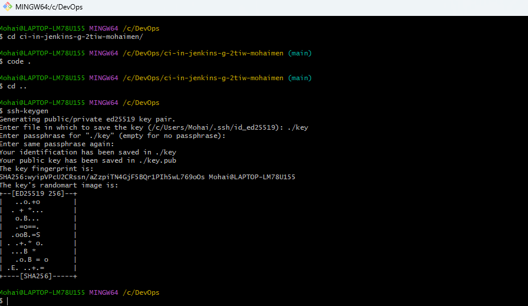
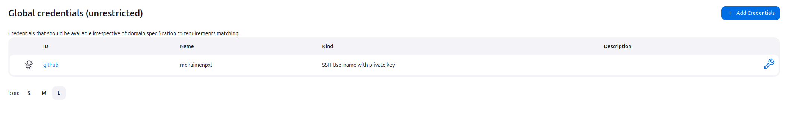
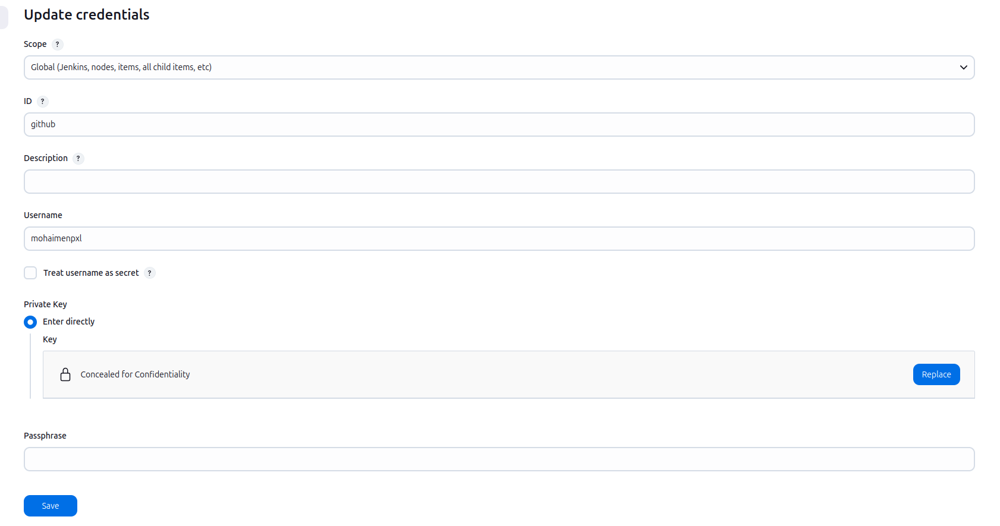
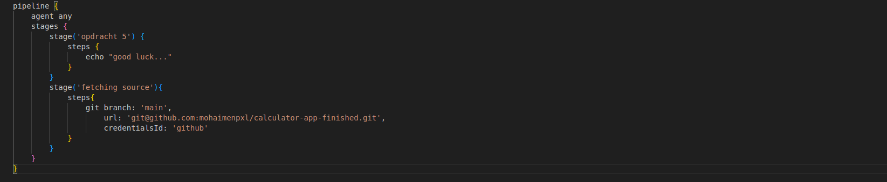
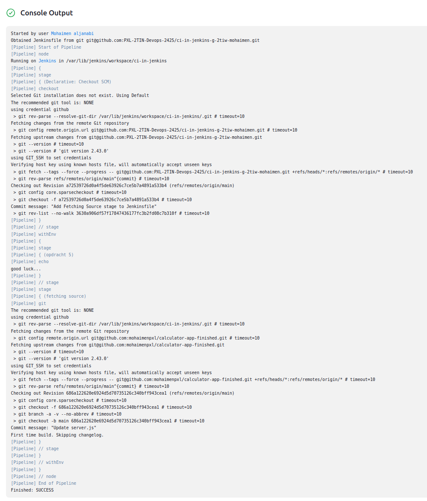

Vul onderstaande aan met de antwoorden op de vragen uit de readme.md file. Wil je de oplossingen file van opmaak voorzien? Gebruik dan [deze link](https://github.com/adam-p/markdown-here/wiki/Markdown-Cheatsheet) om informatie te krijgen over
opmaak met Markdown.

a)
- De stage "Fetching Source" werd toegevoegd om de source code van de calculator-app uit mijn geforkte GitHub repository op te halen. Hierbij is er gebruik gemaakt van de Jenkins credential manager.

- Ik heb op mijn terminal dit commando gebruikt om SSH-sleutel te genereren 1)key.pub voor public key en key voor private key: ssh-keygen 

    

- Ik heb gezorgd dat het hostname gedeelte van de sleutel niet mee kopieerde.

    

- In Jenkins heb ik de private sleutel toegevoegd met een ID en mijn github username

    
    

- en dan heb ik mijn credential hier gebruikt

    

- In de Jenkinsfile heb ik de stage Fetching Source toegevoegd om de source code van mijn geforkte repository op te halen: 

    

- Hier is mijn console output: 

    
b)

c)

d)