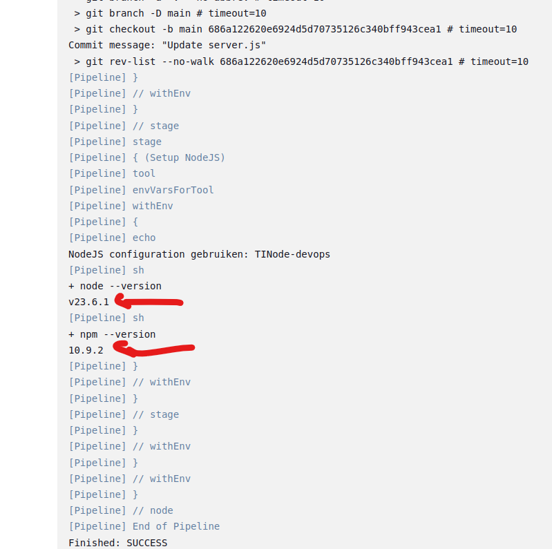
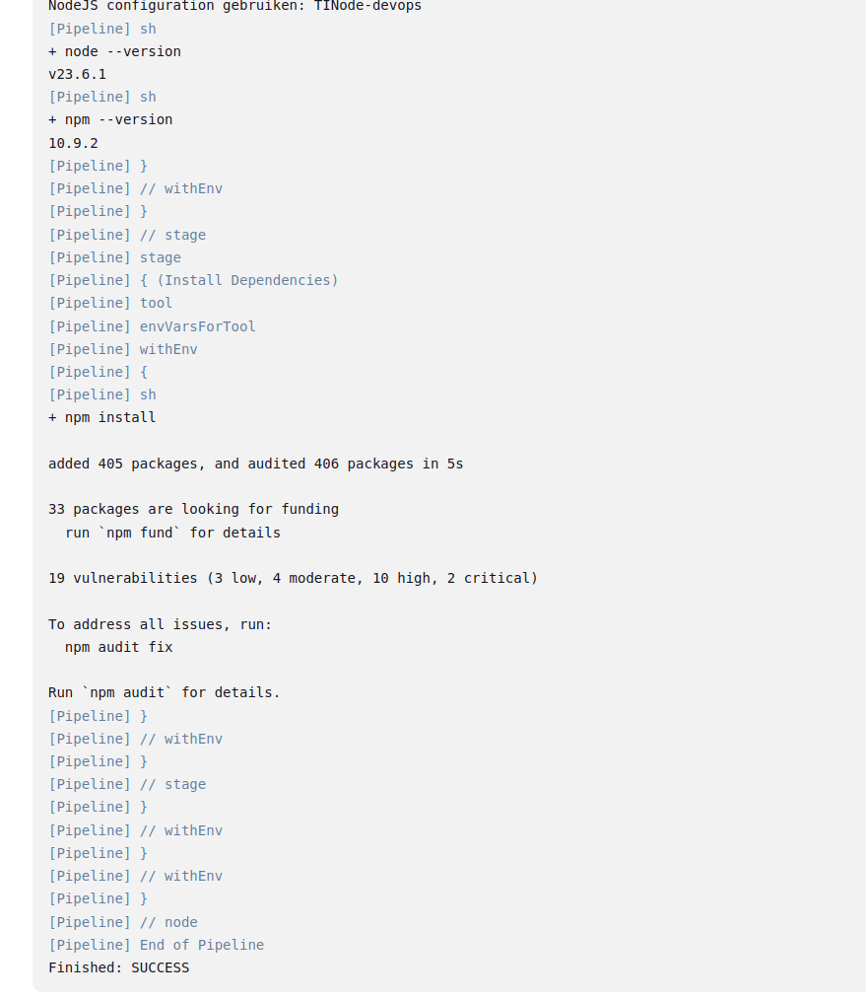
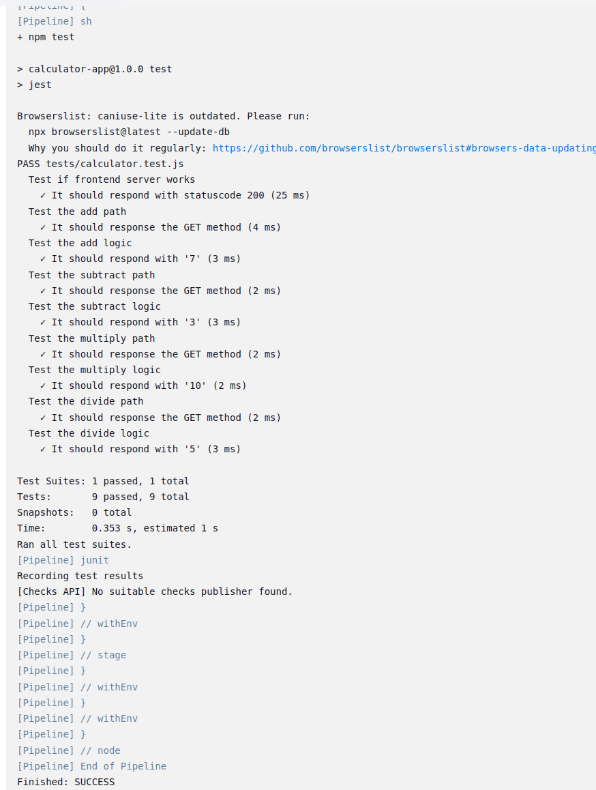
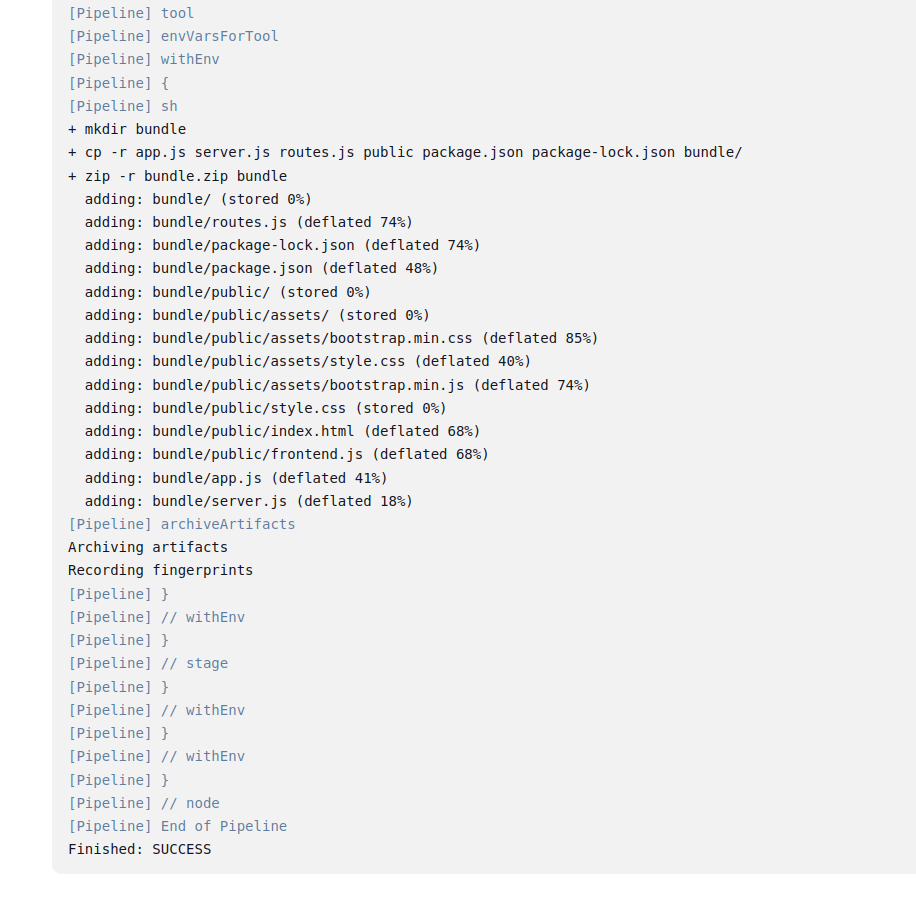
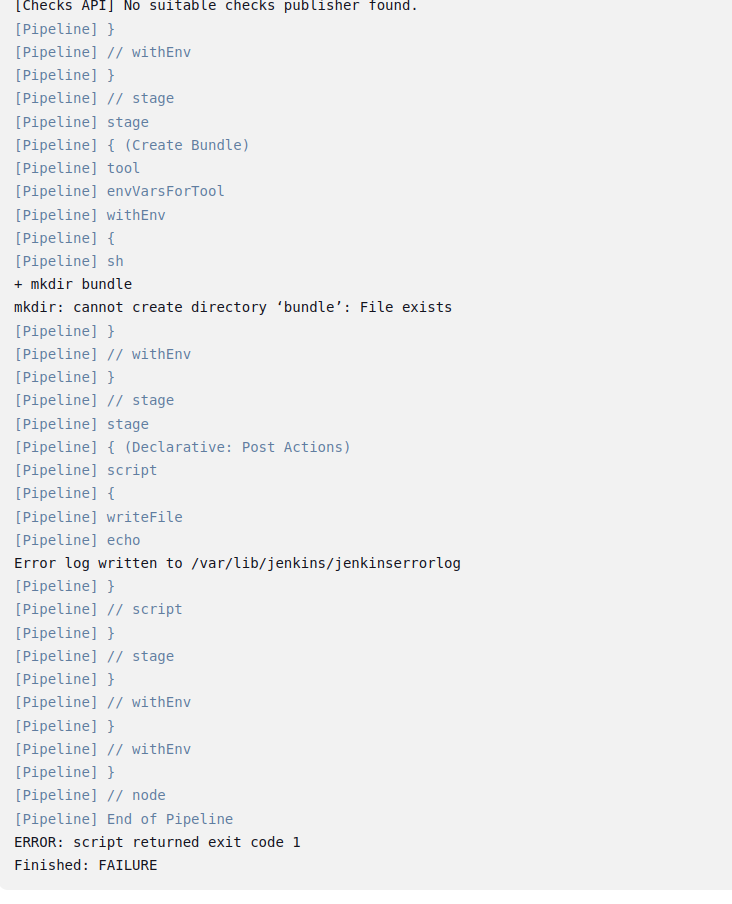
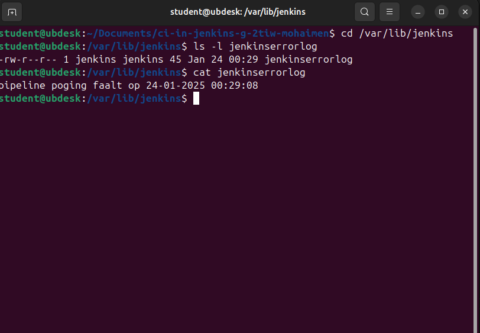
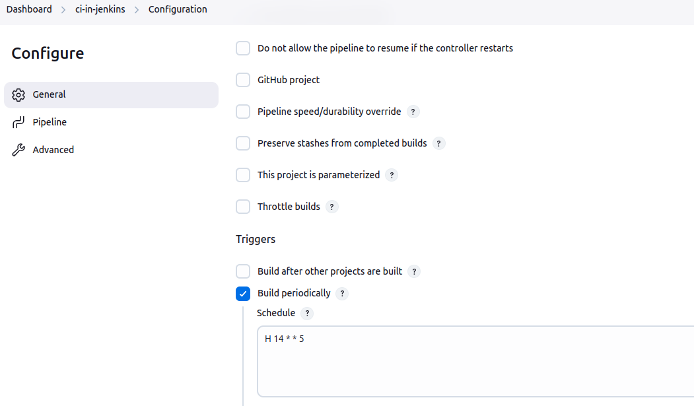

Vul onderstaande aan met de antwoorden op de vragen uit de readme.md file. Wil je de oplossingen file van opmaak voorzien? Gebruik dan [deze link](https://github.com/adam-p/markdown-here/wiki/Markdown-Cheatsheet) om informatie te krijgen over
opmaak met Markdown.

a)
 - De stage "Fetching Source" werd toegevoegd om de source code van de calculator-app uit mijn geforkte GitHub repository op te halen. Hierbij is er gebruik gemaakt van de Jenkins credential manager.

 - Ik heb op mijn terminal dit commando gebruikt om SSH-sleutel te genereren 1)key.pub voor public key en key voor private key: ssh-keygen 

    

 - Ik heb gezorgd dat het hostname gedeelte van de sleutel niet mee kopieerde.

    

 - In Jenkins heb ik de private sleutel toegevoegd met een ID en mijn github username

    
    

 - en dan heb ik mijn credential hier gebruikt

    

 - In de Jenkinsfile heb ik de stage Fetching Source toegevoegd om de source code van mijn geforkte repository op te halen: 

    

 - Hier is mijn console output: 

    

---

b)
 - Na de installatie van NodeJs plugin via plugins in manage jenkins heb ik dit toegoevoegd in de Global tool configuration

    

 - Ik heb ook tools{nodejs 'TINnode-devops'} toegevoegd om de naam van mijn NodeJs installatie te geven dat ik geconfigureerd heb.
 - en Ik heb een stage toegevoegd namelijk Setup NodeJS

    

 - de console output

    

---

c)

 - build van Fetching Source

    

 - build van NodeJS configuration

    

 - build van installing dependencies

    

 - build van unittest met een rapport gemaakt 

    

 - build van Create bundle 

    

 - build van Success, Failure

    

 - de failed build in de jenkinserrorlog

    

---

d)

 - Automatisch pipeline, elke vrijdag om 14u
    1. Geopend de pipeline configuratie in Jenkins
    2. In de sectie **Triggers** heb ik **Build periodically** ingeschakeld.
    3. Dit cron expressie ingevoerd: **H 14 * * 5**

    